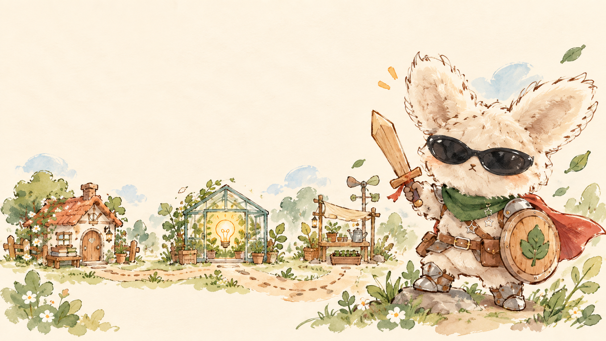

  

<h1 align="center">你好，我是 wenb 👋</h1>

<strong>学生 · 开发者 · 花园里的研究冒险者</strong> Student · Developer · Research Adventurer

  

  
  

## 🗺️ 我的冒险地图 · My adventure map

我是一名正在探索智能世界的学生开发者。我的旅途从机器学习出发，沿着图结构寻找新的表达方式，也尝试让算法更好地理解医学影像。

I am a student developer exploring intelligent systems—from machine learning and graph-structured representations to meaningful applications in medical imaging.

| 🌱 正在培育 · Growing | 🔭 正在探索 · Exploring | 🩺 希望抵达 · Destination |
| --- | --- | --- |
| Machine Learning | Graph Foundation Models | Medical Imaging |

## 🏕️ 项目远征 · Project expedition

  <a href="https://github.com/wen070705/Zhi-zhang-smart-accounting-"><strong>① Zhi-Zhang</strong> 智账 · 从工具出发</a>
  &nbsp;&nbsp;━━━➤&nbsp;&nbsp;
  <a href="https://github.com/wen070705/Visionary-Grove"><strong>② Visionary Grove</strong> 绘梦花园 · 让想法生长</a>
  &nbsp;&nbsp;━━━➤&nbsp;&nbsp;
  <a href="https://github.com/wen070705/lianlixiaozhan"><strong>③ Lianli Xiaozhan</strong> 连理小站 · 走向真实应用</a>

| 起点 · Origin | 成长 · Growth | 应用 · Fieldwork |
| --- | --- | --- |
| [**Zhi-Zhang Smart Accounting**](https://github.com/wen070705/Zhi-zhang-smart-accounting-) | [**Visionary Grove**](https://github.com/wen070705/Visionary-Grove) | [**Lianli Xiaozhan**](https://github.com/wen070705/lianlixiaozhan) |
| 我的第一段开发实践 | 让每一个奇思妙想生根发芽 | 识别病虫害，把技术带到田间 |
| My first building experience | A garden where ideas take root | Identifying pests and plant diseases |

## 📊 冒险记录 · Journey log

  
  

<picture>
  <source media="(prefers-color-scheme: dark)" srcset="https://raw.githubusercontent.com/wen070705/wen070705/output/github-snake-dark.svg" />
  <source media="(prefers-color-scheme: light)" srcset="https://raw.githubusercontent.com/wen070705/wen070705/output/github-snake.svg" />
  
</picture>

## ✉️ 在篝火旁找到我 · Meet me at camp

- GitHub: [@wen070705](https://github.com/wen070705)
- Email: [wenb@mail.dlut.edu.cn](mailto:wenb@mail.dlut.edu.cn)
- Interactive portfolio: [wen070705.github.io](https://wen070705.github.io)

<em>Keep learning. Keep growing. The next path appears when we take the first step.</em>

